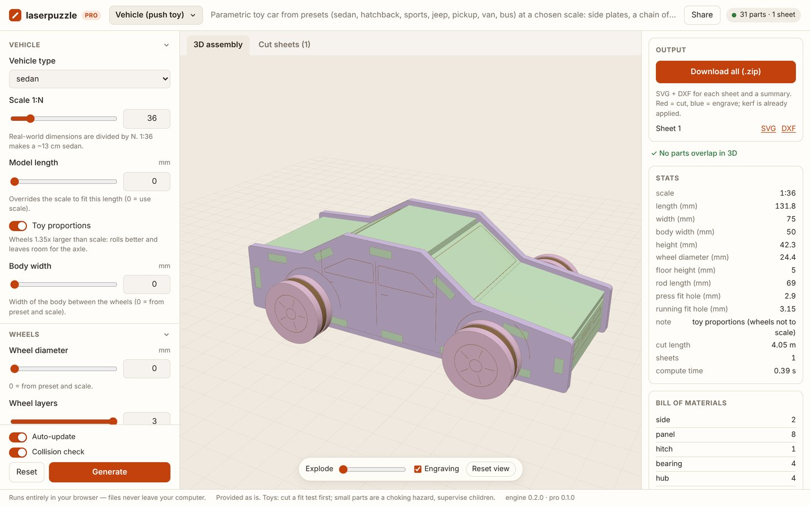
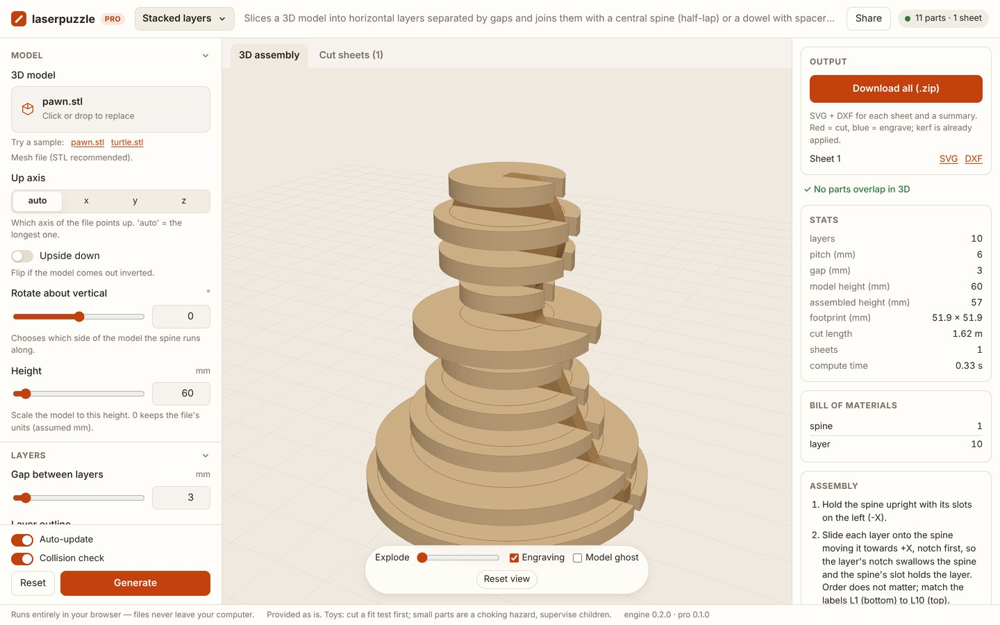
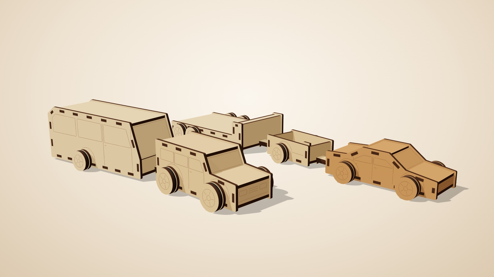
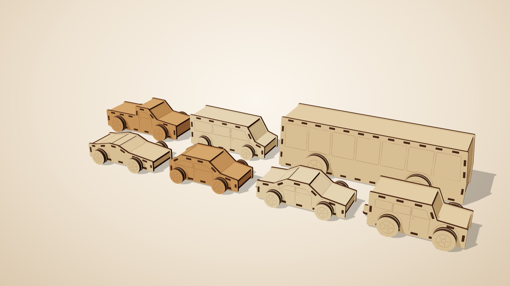
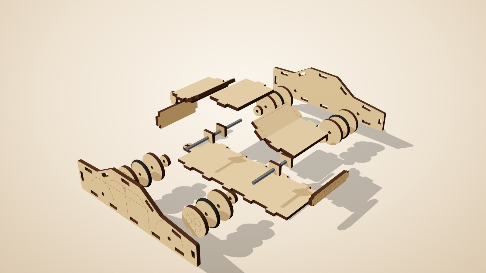
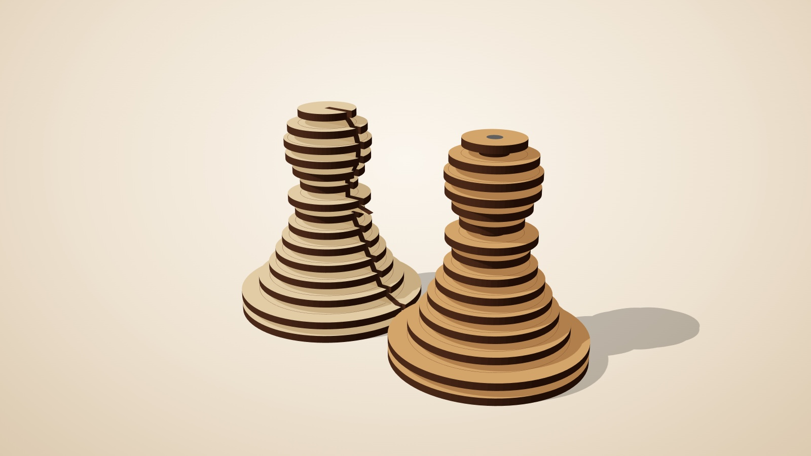
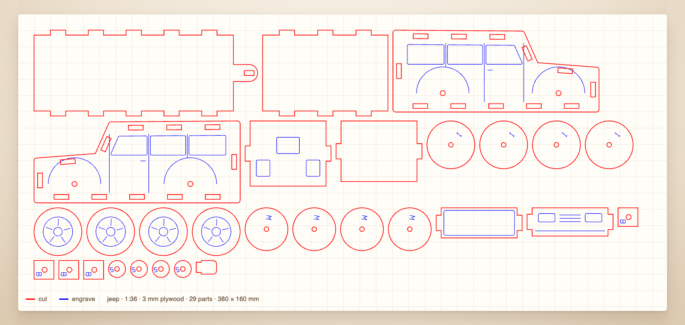
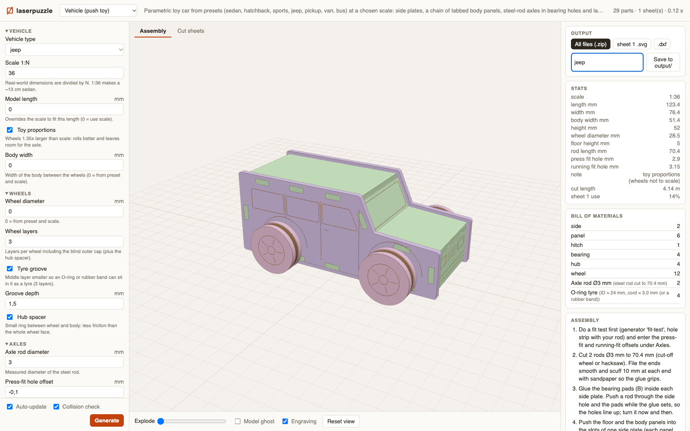

# laserpuzzle

Generate laser-cut 3D puzzles (flat parts that slot together into a 3D object) from 3D models,
drawings and parameters. Preview the assembly in 3D, check the cut sheets, export SVG/DXF.

> **Try it online: [laserpuzzle.app](https://laserpuzzle.app)**. It's the hosted version, with nothing to install.
> It runs entirely in your browser (Python via WebAssembly), so your models and files never leave your computer.
> Pick a generator, tweak the parameters and download cut-ready SVG/DXF.

<table>
<tr>
<td width="50%"><a href="https://laserpuzzle.app"></a></td>
<td width="50%"><a href="https://laserpuzzle.app"></a></td>
</tr>
</table>



*Pick a vehicle and a scale, get cut files for a push toy that actually rolls: tabbed plywood body, steel-rod
axles, laminated wheels, and a peg-and-ring hitch so every car can tow every trailer.*

<table>
<tr>
<td width="50%"><br>
<sub><b>Seven vehicles, four trailers</b>: sedan, hatchback, sports, jeep, pickup, van, bus at any scale 1:N.</sub></td>
<td width="50%"><br>
<sub><b>Every part placed in 3D</b> and checked for collisions before you cut, including coupled trailers
swinging ±35°.</sub></td>
</tr>
<tr>
<td><br>
<sub><b>Any STL into stacked layers</b>, held by a half-lap spine (left) or a dowel with spacers (right).</sub></td>
<td><br>
<sub><b>Cut-ready SVG/DXF</b>: kerf compensated, nested, labelled. Red cuts, blue engraves.</sub></td>
</tr>
</table>

Everything runs in a local web app: change a parameter and watch the model, the sheets and the bill of
materials update.



Generators so far:

| id | what it makes |
|---|---|
| `stacked-layers` | Slices a model (e.g. a chess piece) into layers with gaps, joined by a central spine or a dowel + spacers |
| `fit-test` | Calibration coupon to find the right kerf / slot clearance (and rod hole fits) for your material |
| `vehicle` | Push-toy cars and trailers (sedan, jeep, van, bus, box/flatbed/container/caravan trailer) at scale 1:N: tabbed panel body, steel-rod axles, laminated wheels, peg-and-ring hitch |

Planned: cars from 3 drawings, humanoid figures, simple mechanisms, marble runs — see [docs/roadmap.md](docs/roadmap.md).

## Install

Python 3.10+. With [uv](https://docs.astral.sh/uv/):

```bash
uv venv
source .venv/bin/activate
uv pip install -e ".[dev]"
```

(or `python3 -m venv .venv && source .venv/bin/activate && pip install -e ".[dev]"`)

## Use

```bash
laserpuzzle ui                 # opens http://127.0.0.1:8765 — pick a generator and an STL, tweak, download
```

The UI lists model files from the current folder (and `inputs/`, where uploads go). **Save to output/** writes
`output/<name>/sheet1.svg`, `sheet1.dxf`, `summary.json` and the normalised model.

Command line:

```bash
laserpuzzle run stacked-layers -s model=pawn.stl -s thickness=3 -s layer_gap=3 -o output/pawn
laserpuzzle run fit-test -s thickness=3 -o output/fit
laserpuzzle params stacked-layers     # all parameters with help
```

Cut files: **red = cut, blue = engrave/score**, units mm. Import the SVG into LightBurn (or your laser software)
and assign settings per colour. Read [docs/fabrication.md](docs/fabrication.md) before your first cut.

## Docs

- [docs/architecture.md](docs/architecture.md) — how the pieces fit together
- [docs/adding-a-generator.md](docs/adding-a-generator.md) — write your own generator
- [docs/fabrication.md](docs/fabrication.md) — kerf, clearance, materials, laser software
- [docs/generators/](docs/generators/) — per-generator details
- [docs/roadmap.md](docs/roadmap.md) — planned generators and core features
